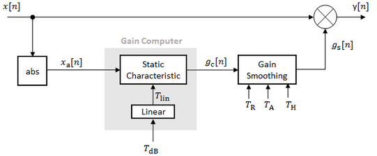
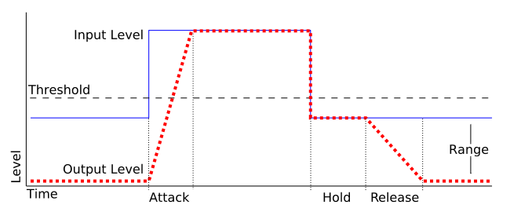
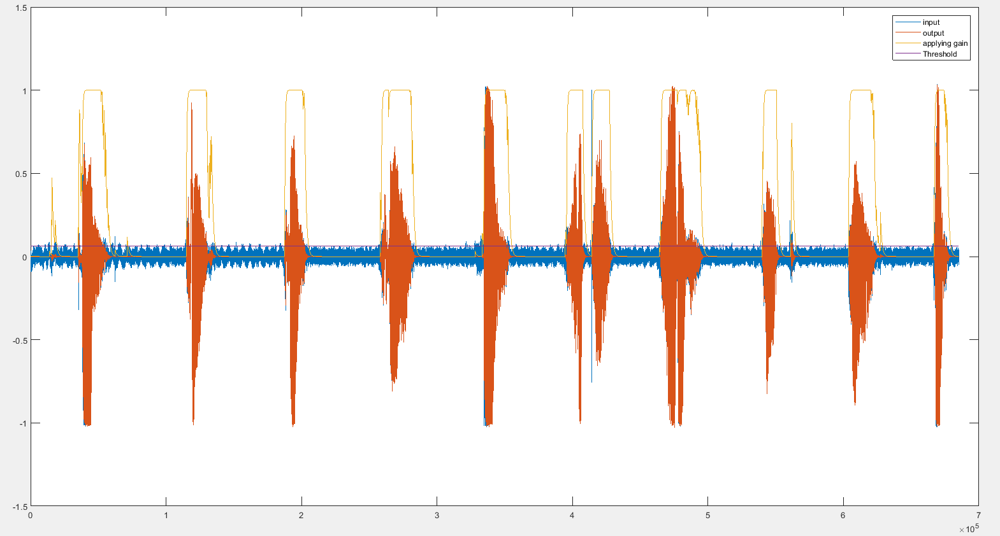

# Noise Gate Usage

​	This is a c version noise gate

V 1.1	Add the description of principle and  API


## What is noise gate

You can look at the wiki for more details.

https://en.wikipedia.org/wiki/Noise_gate


## Noise Gate structure

​	In our design, the noise gate can be descripted as the below structure:



​	

​	Noise Gate mainly consist of two parts, `Gain computer `and `Gain smoothing`. The `Gain computer` is check whether the gain of input signal exceed the threshold or not and open or close the noise gate. Meanwhile, the `gain smoothing` part is to smooth the gain applying to the signal before output, avoiding the gain's abrupt change caused by the frequently switch of noise gain.

​	Below is a typical  static characteristics of noise gate:

​						 

​	

​	The specific processing steps are as follows:

1. **Gain computer**

   ​	Check whether the input signal exceed the threshold or not. As we use a peak detector at this part, which is sensitive to the magnitude of input signal, you can replace it with RMS detector.
   $$
   x[n] \rightarrow abs() \rightarrow x_{abs}[n]
   $$
   

   

2. **Gain smoothing**

   ​	Smooth the gain that will be applied to the output gain, it is controlled by the setting of attack time，release time and hold time parameter. You should find the correct setting adapted to your application.

   

   

   

3. **Applying gain**

   ​	Applying the gain to the input signal and output the processed signal.

   

**Some improvement:**

​	Look at the formulae in step 2. We can find that `gs` will remain and change slowly when the noise gate switch on and off frequently, caused `gc` change between 0 and 1. But when the magnitude of the input signal is around the `threshold` , `gc` will change quickly in a short time, that will cause a misjudge and shake. So as an improvement, we add a pre processing to the input signal and enhance the ability of handle the instantaneous signal around the threshold. The processing can be descripted as the formulae:
$$
y_{env}[n] = \alpha_R*y_{env}[n-1]+(1-\alpha_A)*MAX(x_{abs}[n]-y_{env}[n-1],0)
$$

​	

## Usage

#### Noise Gate Parameter reference

| Parameters  | Range    | unit | Default |
| ----------- | -------- | ---- | ------- |
| samplerate  | -        | Hz   | 48000   |
| releaseTime | (0,4]    | s    | 0.2     |
| attaclkTime | (0,4]    | s    | 0.05    |
| holdTime    | (0,4]    | s    | 0.003   |
| threshold   | [-120,0] | dB   | -24     |

​	You can find the VS2017 project and reference the `noiseGateUnitTest()` function. 

```C++
void noiseGateUintTest() {
	// step 1: read the audio data
	WAV* wavfile = wavfile_read("audio_in_with_noise.wav");
	size_t samplerate = wavfile->sampleRate;
	size_t len = wavfile->totalPCMFrameCount;
	float* out = (float*)malloc(sizeof(float)*len);

	// step 2: initialize the noise gate with default coefficients.
	//			you can custom the parameters by the createNoisGate function.
	//			For more details,please find the readme file.
	NoiseGate_t* NG = createNoiseGate(0.01, 0.2, -24, samplerate);

	// step 3: Apply the noise gate effect to the Mono audio data.
	for (size_t n = 0; n < len; n++)
	{
		runNoiseGate(NG, wavfile->pDataFloat[0][n], out[n]);
	}

	// step 4: Output the processed audio data.
	wavfile_write_f32("noise gate output.wav", &out, len, 1, samplerate);

	wavfile_destory(wavfile);
	freeNoiseGate(NG);
	free(out);
}
```

## Performance

​	We can feed the test signal into the noise gate and check the result.


Processed by the noise gate:


The change of gain when processing:



​	

Original signal：Counting-16-44p1-mono-15secs.wav

Add 40 dB noise to original signal ：signal_with_noise.wav

Signal processed by noise gate：after_noise_gate.wav


